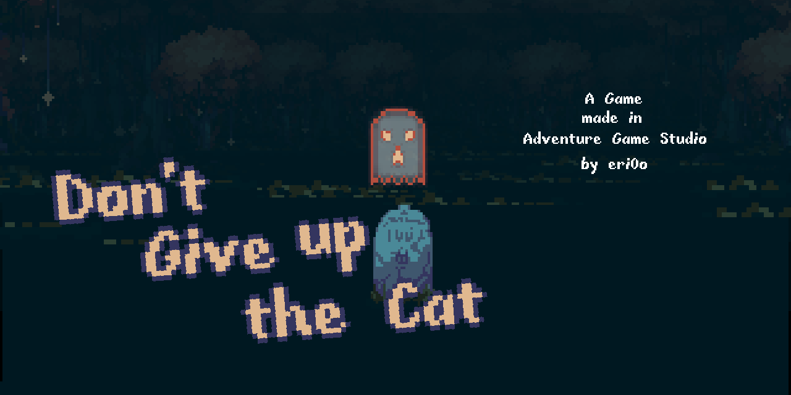

# dont-give-up-the-cat

Tonight, your owner let you out in the woods

## Renderer system

As Adventure Game Studio is a 2D game making software, we are going to leverage it's Overlay functionality, which more closely lets us manipulate sprite textures on screen, with reasonable performance. The following describes how it works.

The Mode7Lite module has my [mode7](https://github.com/ericoporto/mode7) module, but it's stripped of it's bitmap drawing functionality, and only capable of the sprite positioning in a 3D like space capability. This script module allows to define Mode7Objects in a 3D space, and then positioning and resizing overlays to, considering an in world camera, project the visible space on Screen.

Adding or removing objects from this 3D world only considers it for rendering, but removing them doesn't delete them if they are referenced elsewhere, as AGS Script is garbage collected. The mode7 renderer would have to iterate through all objects per frame, and in a reasonably big world this could get expensive. To solve this, we will have to divide the world in smaller parts and introduce a new component to handle this, the ZoneManager.

The ZoneManager divides the world in a grid, and inserts the player in the center of a 3x3 selection of cells in this grid. These 9 cells are considered active and other cells are considered inactive. Only active cells are considered when rendering. When the player switches from a cell space to another, all objects gets removed from the Mode7Lite considered world, and then the objects in the current active cells are readded. This allows the player to rotate its head around more fluidly, as there will be a part of the world around it.
